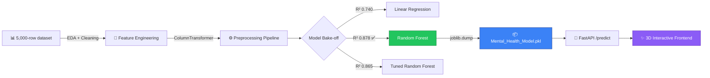
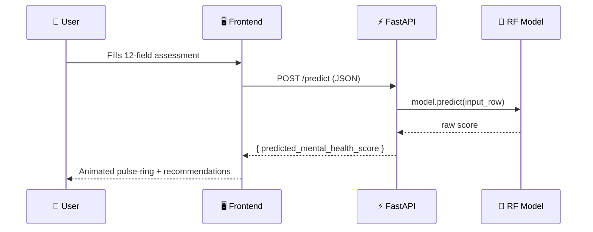

 <div align="center">


<br/>

[](https://python.org)
[](https://fastapi.tiangolo.com)
[](https://scikit-learn.org)
[](https://spline.design)
[](#-license)

<a href="#-live-demo"></a>
<a href="#-getting-started"></a>
<a href="#-api-reference"></a>

</div>

<br/>

<div align="center">

</div>

## 📖 Overview

**MindPulse AI** turns a student's everyday habits — screen time, sleep, stress, study load, physical activity — into a **Mental Health Score (0–10)**, delivered in under a minute through a cinematic, interactive interface.

It's a genuine end-to-end ML product, not just a notebook:



> ⚠️ **Disclaimer:** This is a lifestyle-based research estimate, not a medical diagnosis. If you or someone you know is struggling, please reach out to a qualified counselor or mental health professional.

---

## ✨ Features

<table>
<tr>
<td width="50%" valign="top">

### 🎨 Frontend Experience
- 🧠 **Interactive 3D brain hero** (Spline) with cursor-reactive glow
- 🌌 Floating parallax orbs that follow the mouse
- 🎚️ Live-animated sliders with instant readouts
- 😴 Highlighted "healthy sleep zone" (7–9h) on the sleep slider
- 💫 Circular **pulse-ring** score reveal animation
- 📝 Auto-generated, personalized recommendations
- 📱 Fully responsive, hamburger nav on mobile

</td>
<td width="50%" valign="top">

### ⚙️ Engineering
- 🔬 Full EDA notebook (distributions, correlation heatmap, outlier handling)
- 🧵 `ColumnTransformer` pipeline: log-transform, scaling, ordinal + one-hot encoding
- 🌲 Random Forest Regressor chosen after a 3-model bake-off
- 🎯 `RandomizedSearchCV` hyperparameter tuning explored
- ⚡ FastAPI serves **both** the model and the static frontend
- 🔒 Stateless — nothing is stored server-side
- 📦 Single `joblib` artifact, version-pinned for reproducibility

</td>
</tr>
</table>

---

## 🎥 Live Demo

<div align="center">

> 🔗 Add your deployed link here once hosted (Render / Railway / HuggingFace Spaces)
>
> `https://mindpulse-ai.onrender.com`


</div>

<details>
<summary>🖼️ <b>Click to preview the interface</b></summary>
<br/>

| Hero (3D Brain) | Assessment Form | Result (Pulse Ring) |
|:---:|:---:|:---:|
| *add screenshot* | *add screenshot* | *add screenshot* |

> Drop your own screenshots/GIFs into a `docs/` folder and swap the paths above — a screen recording of the pulse-ring animation looks great here.

</details>

---

## 🛠️ Tech Stack

<div align="center">


</div>

## 🗂️ Project Structure

```
Mental_Health_Prediction/
├── backend/
│   └── main.py                  # FastAPI app — serves model + static frontend
├── frontend/
│   ├── index.html                # Landing page, form, result UI
│   ├── style.css                 # Full styling & animations
│   ├── script.js                 # Form logic, API calls, animated results
│   └── assets/
│       ├── brain-network.svg
│       └── pulse-ripple.svg
├── student_mental_health_ipynb.ipynb   # EDA + model training notebook
├── Student Social Media And Mental Health Impact.csv   # Dataset (5,000 students)
├── Mental_Health_Model.pkl       # Trained Random Forest pipeline
├── requirements.txt
└── README.md
```

---

## 🤖 Model & Performance

5,000 student records × 12 features were preprocessed through a `ColumnTransformer` (log-transform for skewed features → `StandardScaler`, `OrdinalEncoder` for stress level, `OneHotEncoder` for categoricals) and benchmarked across three approaches:

<div align="center">

| Model | Test R² | Test MAE | Test RMSE | |
|---|:---:|:---:|:---:|---|
| Linear Regression | 0.740 | 0.536 | 0.676 | 🟡 baseline |
| **Random Forest (default)** | **0.878** | **0.347** | **0.464** | ✅ **selected** |
| Random Forest (tuned) | 0.865 | 0.369 | 0.487 | 🟠 slightly less generalizable |

**R² comparison**

`Linear Regression`  ██████████████░░░░░░ 74.0%
`Random Forest`      ████████████████████ 87.8% 🏆
`RF (tuned)`         ███████████████████░ 86.5%

</div>

**The default Random Forest Regressor generalized best** on held-out test data and was serialized with `joblib` as `Mental_Health_Model.pkl`, loaded directly by FastAPI at startup.

<details>
<summary>📊 <b>Key EDA insights (click to expand)</b></summary>
<br/>

- 📉 Higher average daily social media usage correlates with a **lower** mental health score
- 😴 Sleep in the **7–9h** range is associated with noticeably better scores
- 📚 Study hours and physical activity show a mild **positive** relationship with wellbeing
- 😰 Self-reported **stress level** is one of the strongest predictors of the target score
- 🌍 Country was grouped into top-10 + "Other" to reduce cardinality before encoding

</details>

---

## 🚀 Getting Started

### Prerequisites
 

### Installation

```bash
# 1. Clone the repository
git clone https://github.com/Omrawat11/Mental_Health_Prediction.git
cd Mental_Health_Prediction

# 2. Create a virtual environment (recommended)
python -m venv venv
source venv/bin/activate      # On Windows: venv\Scripts\activate

# 3. Install dependencies
pip install -r requirements.txt

# 4. Run the app
uvicorn backend.main:app --reload --app-dir backend
```

Then open **http://127.0.0.1:8000** — FastAPI serves the frontend directly, no separate dev server needed.

> ⚠️ **scikit-learn version note:** `Mental_Health_Model.pkl` was serialized with `scikit-learn==1.6.1`. If you hit an `AttributeError` on load, pin the exact version:
> ```bash
> pip install scikit-learn==1.6.1
> ```

---

## 📡 API Reference

### `POST /predict`

<table>
<tr><td>

**Request**
```json
{
  "Age": 21,
  "Gender": "Male",
  "Country": "India",
  "Academic_Level": "Undergraduate",
  "Most_Used_Platform": "Instagram",
  "Purpose_Of_Use": "Entertainment",
  "Avg_Daily_Usage_Hours": 4.5,
  "Daily_Unlocks": 85,
  "Study_Hours": 3,
  "Physical_Activity_Hours": 1,
  "Sleep_Hours_Per_Night": 7,
  "Stress_Level": "Medium"
}
```

</td><td>

**Response**
```json
{
  "predicted_mental_health_score": 6.42
}
```

</td></tr>
</table>



### `GET /`
Serves the frontend (`index.html`).

---

## 🧭 Roadmap

- [ ] 🚢 Deploy live demo (Render/Railway/HF Spaces)
- [ ] 🔍 SHAP-based explainability — show *why* a score was predicted
- [ ] 📈 Historical trend tracking (opt-in, local only)
- [ ] 🐳 Dockerize backend for one-command deployment
- [ ] ✅ Automated tests for the `/predict` endpoint
- [ ] 🌐 i18n support for the frontend

## 🤝 Contributing

Contributions, issues, and feature requests are welcome!

```bash
# Fork it, then:
git checkout -b feature/your-idea
git commit -m "Add: your idea"
git push origin feature/your-idea
# Open a Pull Request 🎉
```

## 📄 License

Licensed under the **MIT License** — free to use, modify, and distribute.

## 👤 Author

<div align="center">

**Om Rawat**
B.Tech AI & ML, Lakshmi Narain College of Technology, Bhopal

[](https://github.com/Omrawat11)
[](https://www.linkedin.com/in/om-rawat-530499399/)

</div>


